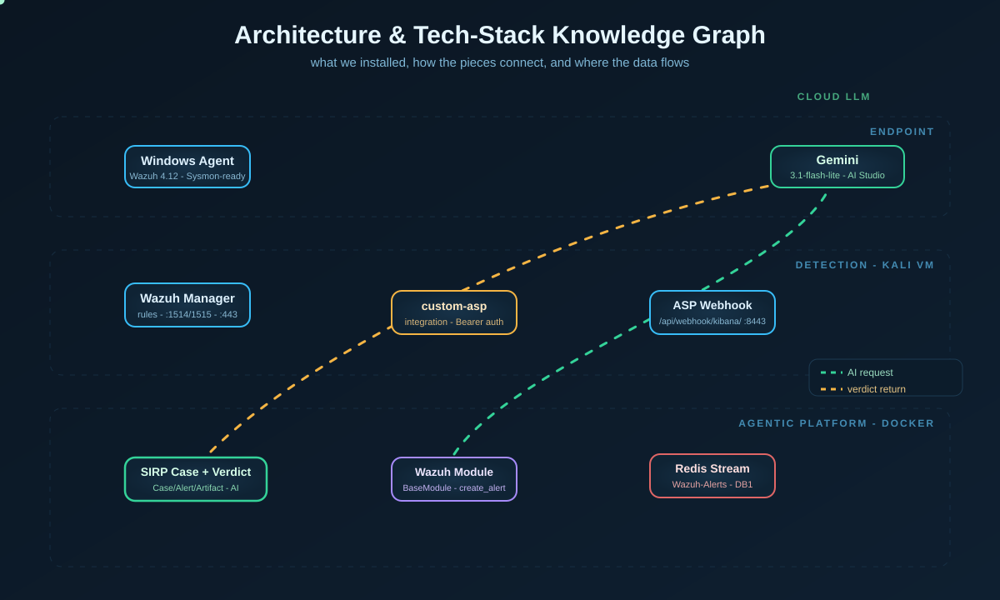

<p align="center">
  
</p>

<h1 align="center">Agentic SOC Platform: Wazuh -> ASP -> Gemini</h1>

<p align="center">
  <b>AI-assisted L1 triage that turns Wazuh alerts into investigated ASP Cases with Gemini verdicts.</b><br/>
  <sub>Lab 12 Adapted - Kali / VirtualBox / Docker Compose / Wazuh / Google AI Studio</sub>
</p>

<p align="center">
  
  
  
  
  
</p>

---

## Start Here

1. Read the full guide first:
   - `Lab12_Agentic_SOC_Platform_Guide_v2.docx`
  
2. Download and deploy the two required files:
   - `custom-asp` - Wazuh integration script that pushes alerts to ASP.
   - `wazuh_alerts_module.py` - ASP custom Module that creates Cases, Alerts, Artifacts, and schedules Gemini analysis.

The complete click-by-click build, screenshots, troubleshooting, and teardown are in the DOCX guide.

---

## What This Project Builds

```text
Windows endpoint
  -> Wazuh Agent
  -> Wazuh Manager on Kali
  -> custom-asp integration
  -> ASP /api/webhook/kibana/
  -> Redis Stream: Wazuh-Alerts
  -> ASP Wazuh Module
  -> SIRP Case + Alert + Artifacts
  -> Gemini AI Verdict
```

<p align="center">
  
</p>

---

## Repository Contents

| File | Purpose |
|---|---|
| `README.md` | GitHub landing page |
| `Lab12_Agentic_SOC_Platform_Guide_v2.docx` | Full build and handover document, add this before publishing |
| `custom-asp` | Wazuh manager integration script |
| `wazuh_alerts_module.py` | ASP Module for `Wazuh-Alerts` stream |
| `hero-banner.svg` | Animated top banner |
| `architecture-graph.svg` | Animated architecture / tech-stack diagram |
| `.gitignore` | Prevents secrets and runtime artifacts from being committed |
| `LICENSE` | MIT License |

---

## Why This Version Exists

The upstream project changed enough that several public instructions were stale during this build. This repository documents the exact path that worked:

- Kali Docker install uses `docker.io` plus a manually installed Compose v2 plugin.
- The ASP release package is versioned, so the GitHub API is used to fetch the correct `asp-compose-*.tar.gz` asset.
- Wazuh Dashboard occupies port 443, so ASP is moved to port 8443.
- ASP v0.5.2 does not expose a generic `/webhook/<stream>` route. The working path is `/api/webhook/kibana/`.
- Wazuh is integrated by masquerading as a Kibana webhook and setting `rule.name = Wazuh-Alerts`.
- `BaseModule` does not expose helper methods; the Module imports `create_alert_with_context` directly and maps the actual ASP model fields.
- Artifact fields are enum-constrained; `name` is an OCSF-style label and `value` stores the real IOC value.
- Gemini verdict quality improves when the Module enriches the Case description with rule ID, level, host, user, source IP, MITRE details, and raw log context.

---

## Quick Reference

```bash
# Install ASP Module
cp wazuh_alerts_module.py ~/asp-compose/custom/modules/
# ASP UI: Custom -> Modules -> Refresh / Validate

# Install Wazuh integration
sudo cp custom-asp /var/ossec/integrations/custom-asp
sudo chmod 750 /var/ossec/integrations/custom-asp
sudo chown root:wazuh /var/ossec/integrations/custom-asp
sudo dos2unix /var/ossec/integrations/custom-asp 2>/dev/null

# ossec.conf hook URL must be:
# https://localhost:8443/api/webhook/kibana/

sudo systemctl restart wazuh-manager
sudo tail -f /var/ossec/logs/integrations.log
```

Expected integration log:

```text
custom-asp: SENT <alert name> -> https://localhost:8443/api/webhook/kibana/ HTTP 200
```

Expected ASP result:

```text
ASP UI -> Cases -> New Case with Wazuh artifacts and Gemini AI verdict
```

---

## Security Notes

- Do not commit `.env`, API keys, tokens, Wazuh generated password files, or screenshots containing secrets.
- Revoke the Gemini API key and ASP webhook API key after the lab.
- Use synthetic lab data only when sending alert content to a remote LLM.
- The full cleanup procedure is included in the DOCX guide.

---

## References

- Agentic SOC Platform: https://github.com/FunnyWolf/agentic-soc-platform
- ASP documentation: https://asp.viperrtp.com/
- Wazuh server installation: https://documentation.wazuh.com/current/installation-guide/wazuh-server/step-by-step.html
- Gemini OpenAI-compatible endpoint: https://ai.google.dev/gemini-api/docs/openai

---

<p align="center"><sub>Built, broken, fixed, and documented the hard way. MIT Licensed.</sub></p>
